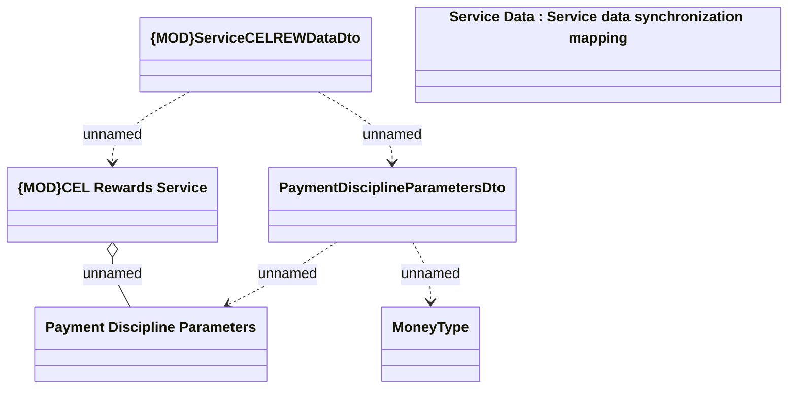

# Service CELREW Data

- **Diagram Type**: Logical
- **Package**: HomerSelect/BSL/Modules/Product Catalog (PRC)/Analytical Model/Service/Provided Services/Interface Provided/ProvideServiceDataWS/Service Data/Service CELREW Data
- **Diagram ID**: 103870
- **Elements**: 6
- **Connectors**: 5

