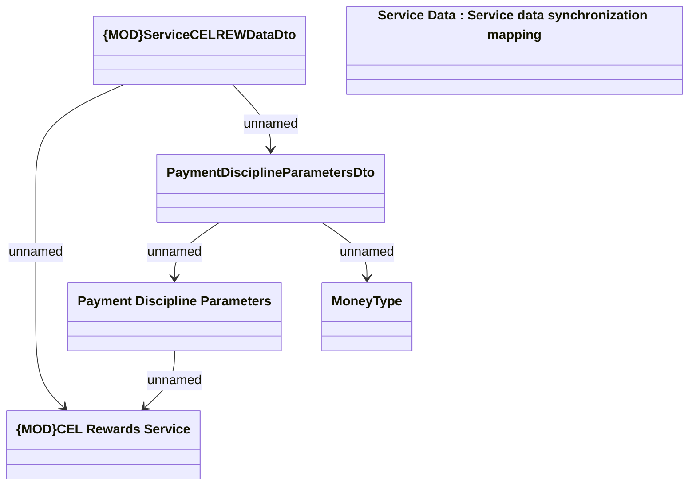

# Service CELREW Data

```mermaid
classDiagram
    class MoneyType["MoneyType"]
    class Payment_Discipline_Parameters["Payment Discipline Parameters"]
    class PaymentDisciplineParametersDto["PaymentDisciplineParametersDto"]
    class MOD_ServiceCELREWDataDto["{MOD}ServiceCELREWDataDto"]
    class MOD_CEL_Rewards_Service["{MOD}CEL Rewards Service"]
    class Service_Data_Service_data_synchronization_mapping["Service Data : Service data synchronization mapping"]
    MOD_ServiceCELREWDataDto --> MOD_CEL_Rewards_Service : unnamed
    MOD_ServiceCELREWDataDto --> PaymentDisciplineParametersDto : unnamed
    PaymentDisciplineParametersDto --> Payment_Discipline_Parameters : unnamed
    PaymentDisciplineParametersDto --> MoneyType : unnamed
    Payment_Discipline_Parameters --> MOD_CEL_Rewards_Service : unnamed
```
