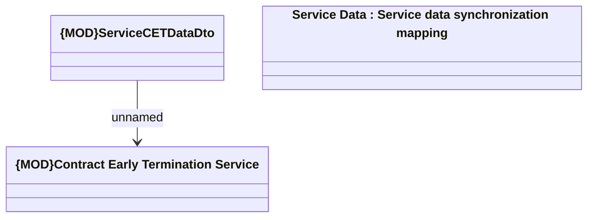

# Service CET Data

```mermaid
classDiagram
    class MOD_ServiceCETDataDto["{MOD}ServiceCETDataDto"]
    class MOD_Contract_Early_Termination_Service["{MOD}Contract Early Termination Service"]
    class Service_Data_Service_data_synchronization_mapping["Service Data : Service data synchronization mapping"]
    MOD_ServiceCETDataDto --> MOD_Contract_Early_Termination_Service : unnamed
```
