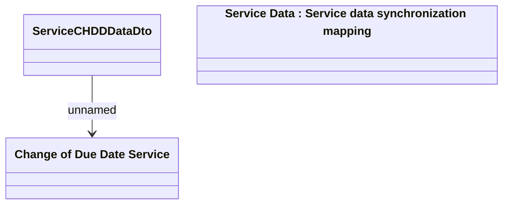

# Service CHDD Data

```mermaid
classDiagram
    class ServiceCHDDDataDto["ServiceCHDDDataDto"]
    class Change_of_Due_Date_Service["Change of Due Date Service"]
    class Service_Data_Service_data_synchronization_mapping["Service Data : Service data synchronization mapping"]
    ServiceCHDDDataDto --> Change_of_Due_Date_Service : unnamed
```
