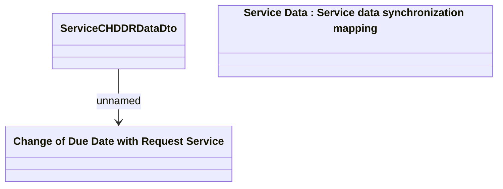

# Service CHDDR Data

```mermaid
classDiagram
    class ServiceCHDDRDataDto["ServiceCHDDRDataDto"]
    class Change_of_Due_Date_with_Request_Service["Change of Due Date with Request Service"]
    class Service_Data_Service_data_synchronization_mapping["Service Data : Service data synchronization mapping"]
    ServiceCHDDRDataDto --> Change_of_Due_Date_with_Request_Service : unnamed
```
