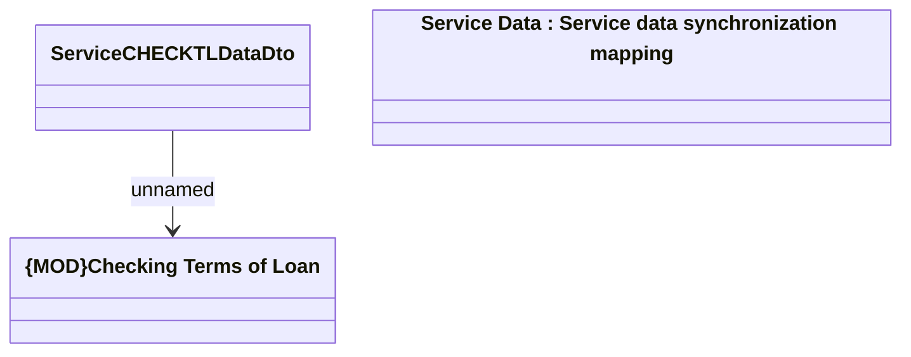

# Service CHECKTL Data

```mermaid
classDiagram
    class ServiceCHECKTLDataDto["ServiceCHECKTLDataDto"]
    class Service_Data_Service_data_synchronization_mapping["Service Data : Service data synchronization mapping"]
    class MOD_Checking_Terms_of_Loan["{MOD}Checking Terms of Loan"]
    ServiceCHECKTLDataDto --> MOD_Checking_Terms_of_Loan : unnamed
```
