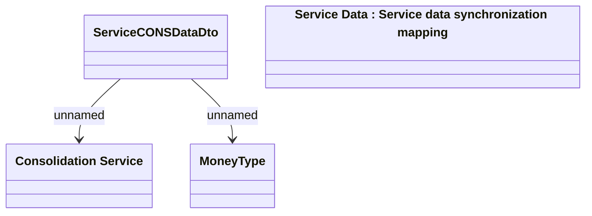

# Service CONS Data

```mermaid
classDiagram
    class MoneyType["MoneyType"]
    class ServiceCONSDataDto["ServiceCONSDataDto"]
    class Consolidation_Service["Consolidation Service"]
    class Service_Data_Service_data_synchronization_mapping["Service Data : Service data synchronization mapping"]
    ServiceCONSDataDto --> Consolidation_Service : unnamed
    ServiceCONSDataDto --> MoneyType : unnamed
```
