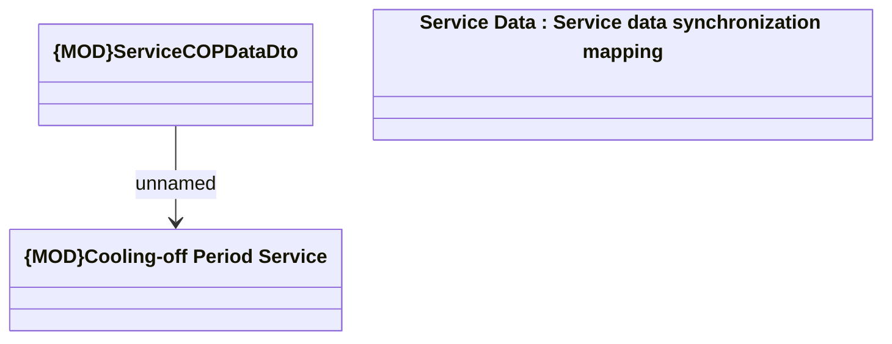

# Service COP Data

```mermaid
classDiagram
    class MOD_ServiceCOPDataDto["{MOD}ServiceCOPDataDto"]
    class MOD_Cooling_off_Period_Service["{MOD}Cooling-off Period Service"]
    class Service_Data_Service_data_synchronization_mapping["Service Data : Service data synchronization mapping"]
    MOD_ServiceCOPDataDto --> MOD_Cooling_off_Period_Service : unnamed
```
