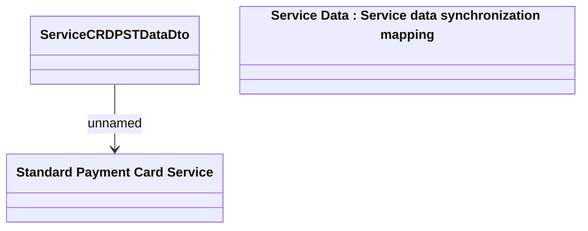

# Service CRDPST Data

```mermaid
classDiagram
    class Standard_Payment_Card_Service["Standard Payment Card Service"]
    class ServiceCRDPSTDataDto["ServiceCRDPSTDataDto"]
    class Service_Data_Service_data_synchronization_mapping["Service Data : Service data synchronization mapping"]
    ServiceCRDPSTDataDto --> Standard_Payment_Card_Service : unnamed
```
