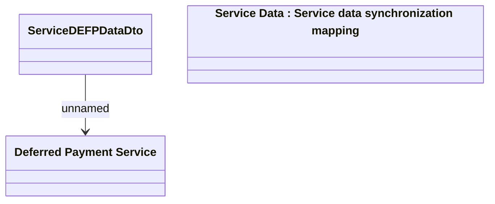

# Service DEFP Data

```mermaid
classDiagram
    class ServiceDEFPDataDto["ServiceDEFPDataDto"]
    class Deferred_Payment_Service["Deferred Payment Service"]
    class Service_Data_Service_data_synchronization_mapping["Service Data : Service data synchronization mapping"]
    ServiceDEFPDataDto --> Deferred_Payment_Service : unnamed
```
