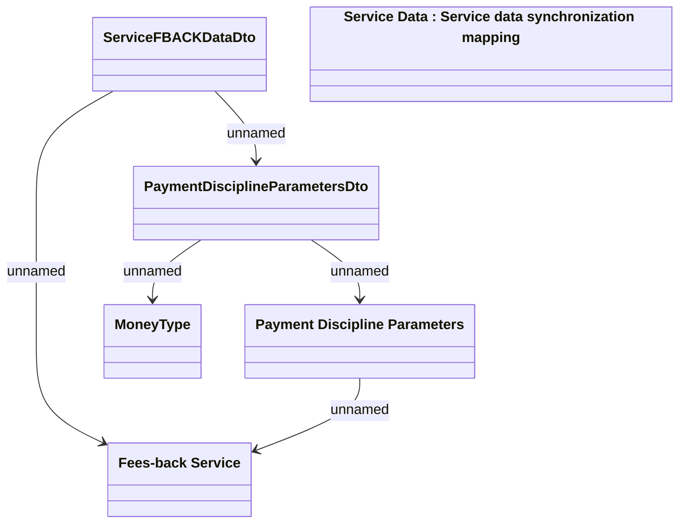

# Service FBACK Data

```mermaid
classDiagram
    class MoneyType["MoneyType"]
    class PaymentDisciplineParametersDto["PaymentDisciplineParametersDto"]
    class Payment_Discipline_Parameters["Payment Discipline Parameters"]
    class ServiceFBACKDataDto["ServiceFBACKDataDto"]
    class Fees_back_Service["Fees-back Service "]
    class Service_Data_Service_data_synchronization_mapping["Service Data : Service data synchronization mapping"]
    ServiceFBACKDataDto --> Fees_back_Service : unnamed
    ServiceFBACKDataDto --> PaymentDisciplineParametersDto : unnamed
    PaymentDisciplineParametersDto --> MoneyType : unnamed
    PaymentDisciplineParametersDto --> Payment_Discipline_Parameters : unnamed
    Payment_Discipline_Parameters --> Fees_back_Service : unnamed
```
