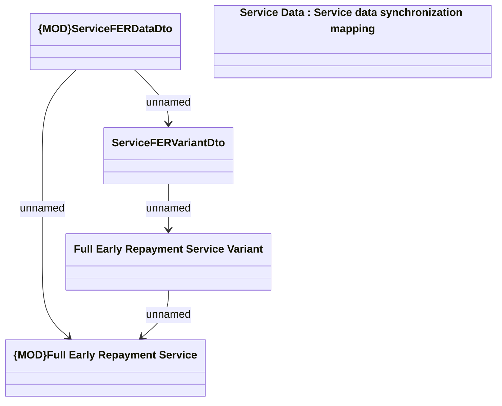

# Service FER Data

```mermaid
classDiagram
    class ServiceFERVariantDto["ServiceFERVariantDto"]
    class Full_Early_Repayment_Service_Variant["Full Early Repayment Service Variant"]
    class MOD_ServiceFERDataDto["{MOD}ServiceFERDataDto"]
    class MOD_Full_Early_Repayment_Service["{MOD}Full Early Repayment Service"]
    class Service_Data_Service_data_synchronization_mapping["Service Data : Service data synchronization mapping"]
    MOD_ServiceFERDataDto --> MOD_Full_Early_Repayment_Service : unnamed
    ServiceFERVariantDto --> Full_Early_Repayment_Service_Variant : unnamed
    MOD_ServiceFERDataDto --> ServiceFERVariantDto : unnamed
    Full_Early_Repayment_Service_Variant --> MOD_Full_Early_Repayment_Service : unnamed
```
