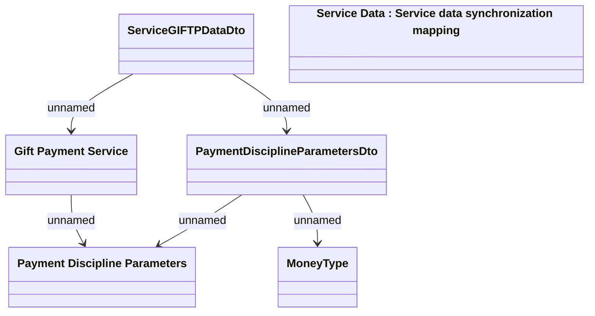

# Service GIFTP Data

```mermaid
classDiagram
    class MoneyType["MoneyType"]
    class PaymentDisciplineParametersDto["PaymentDisciplineParametersDto"]
    class Payment_Discipline_Parameters["Payment Discipline Parameters"]
    class ServiceGIFTPDataDto["ServiceGIFTPDataDto"]
    class Gift_Payment_Service["Gift Payment Service "]
    class Service_Data_Service_data_synchronization_mapping["Service Data : Service data synchronization mapping"]
    ServiceGIFTPDataDto --> Gift_Payment_Service : unnamed
    Gift_Payment_Service --> Payment_Discipline_Parameters : unnamed
    ServiceGIFTPDataDto --> PaymentDisciplineParametersDto : unnamed
    PaymentDisciplineParametersDto --> MoneyType : unnamed
    PaymentDisciplineParametersDto --> Payment_Discipline_Parameters : unnamed
```
