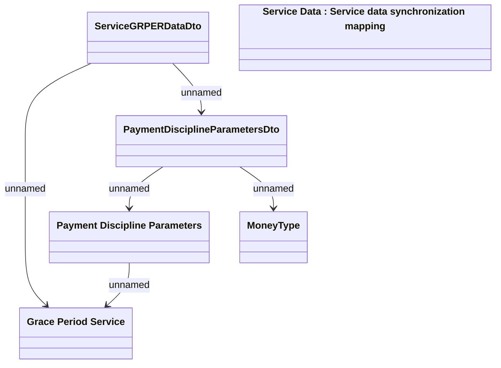

# Service GRPER Data

```mermaid
classDiagram
    class MoneyType["MoneyType"]
    class Payment_Discipline_Parameters["Payment Discipline Parameters"]
    class PaymentDisciplineParametersDto["PaymentDisciplineParametersDto"]
    class ServiceGRPERDataDto["ServiceGRPERDataDto"]
    class Grace_Period_Service["Grace Period Service"]
    class Service_Data_Service_data_synchronization_mapping["Service Data : Service data synchronization mapping"]
    ServiceGRPERDataDto --> Grace_Period_Service : unnamed
    ServiceGRPERDataDto --> PaymentDisciplineParametersDto : unnamed
    PaymentDisciplineParametersDto --> Payment_Discipline_Parameters : unnamed
    PaymentDisciplineParametersDto --> MoneyType : unnamed
    Payment_Discipline_Parameters --> Grace_Period_Service : unnamed
```
