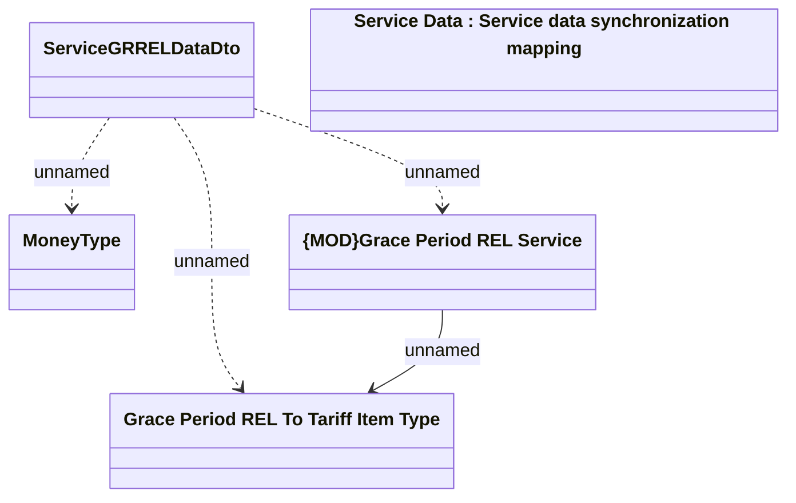

# Service GRREL Data

- **Diagram Type**: Logical
- **Package**: HomerSelect/BSL/Modules/Product Catalog (PRC)/Analytical Model/Service/Provided Services/Interface Provided/ProvideServiceDataWS/Service Data/Service GRREL Data
- **Diagram ID**: 92407
- **Elements**: 5
- **Connectors**: 4

