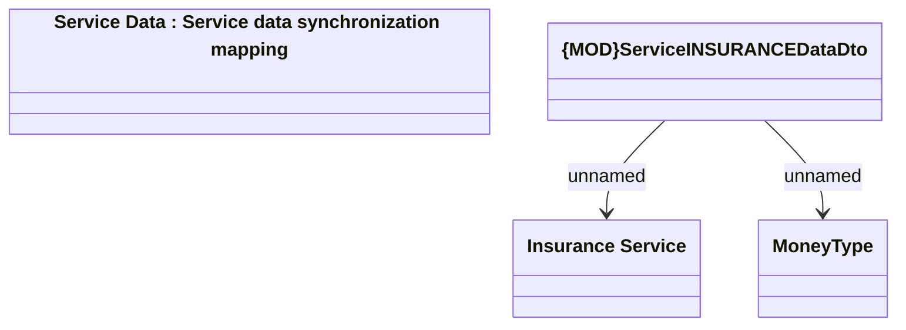

# Service INSURANCE Data

```mermaid
classDiagram
    class MoneyType["MoneyType"]
    class Insurance_Service["Insurance Service"]
    class Service_Data_Service_data_synchronization_mapping["Service Data : Service data synchronization mapping"]
    class MOD_ServiceINSURANCEDataDto["{MOD}ServiceINSURANCEDataDto"]
    MOD_ServiceINSURANCEDataDto --> Insurance_Service : unnamed
    MOD_ServiceINSURANCEDataDto --> MoneyType : unnamed
```
