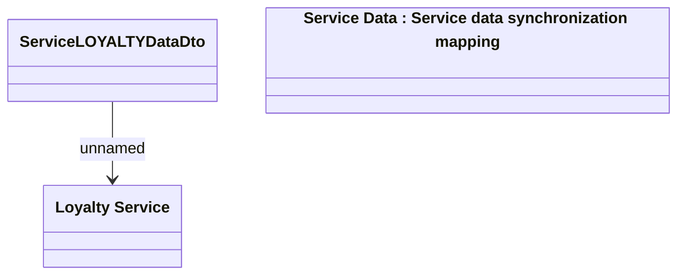

# Service LOYALTY Data

```mermaid
classDiagram
    class Loyalty_Service["Loyalty Service"]
    class ServiceLOYALTYDataDto["ServiceLOYALTYDataDto"]
    class Service_Data_Service_data_synchronization_mapping["Service Data : Service data synchronization mapping"]
    ServiceLOYALTYDataDto --> Loyalty_Service : unnamed
```
