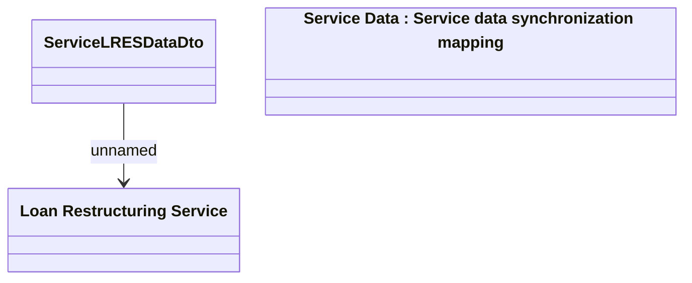

# Service LRES Data

```mermaid
classDiagram
    class ServiceLRESDataDto["ServiceLRESDataDto"]
    class Loan_Restructuring_Service["Loan Restructuring Service"]
    class Service_Data_Service_data_synchronization_mapping["Service Data : Service data synchronization mapping"]
    ServiceLRESDataDto --> Loan_Restructuring_Service : unnamed
```
