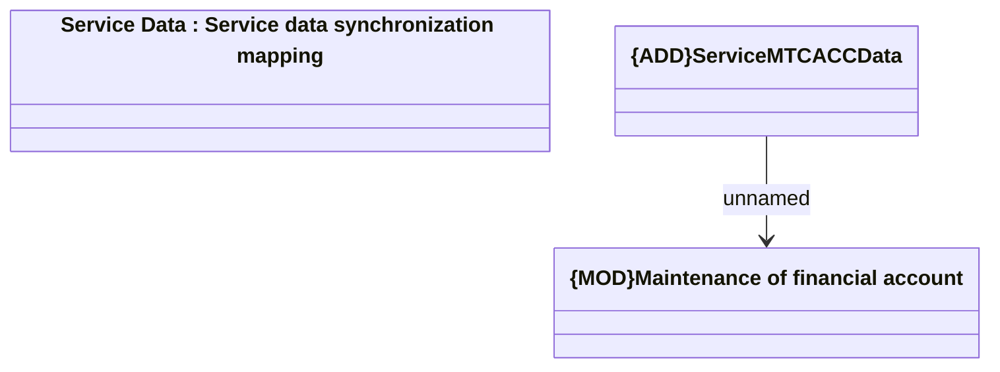

# Service MTCACC data

```mermaid
classDiagram
    class MOD_Maintenance_of_financial_account["{MOD}Maintenance of financial account"]
    class Service_Data_Service_data_synchronization_mapping["Service Data : Service data synchronization mapping"]
    class ADD_ServiceMTCACCData["{ADD}ServiceMTCACCData"]
    ADD_ServiceMTCACCData --> MOD_Maintenance_of_financial_account : unnamed
```
