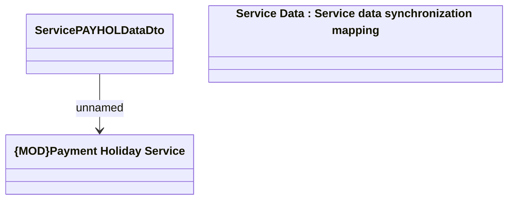

# Service PAYHOL Data

```mermaid
classDiagram
    class ServicePAYHOLDataDto["ServicePAYHOLDataDto"]
    class MOD_Payment_Holiday_Service["{MOD}Payment Holiday Service"]
    class Service_Data_Service_data_synchronization_mapping["Service Data : Service data synchronization mapping"]
    ServicePAYHOLDataDto --> MOD_Payment_Holiday_Service : unnamed
```
