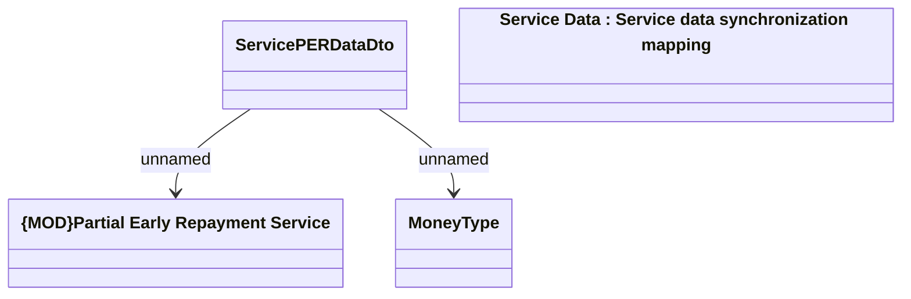

# Service PER Data

```mermaid
classDiagram
    class MoneyType["MoneyType"]
    class ServicePERDataDto["ServicePERDataDto"]
    class MOD_Partial_Early_Repayment_Service["{MOD}Partial Early Repayment Service"]
    class Service_Data_Service_data_synchronization_mapping["Service Data : Service data synchronization mapping"]
    ServicePERDataDto --> MOD_Partial_Early_Repayment_Service : unnamed
    ServicePERDataDto --> MoneyType : unnamed
```
