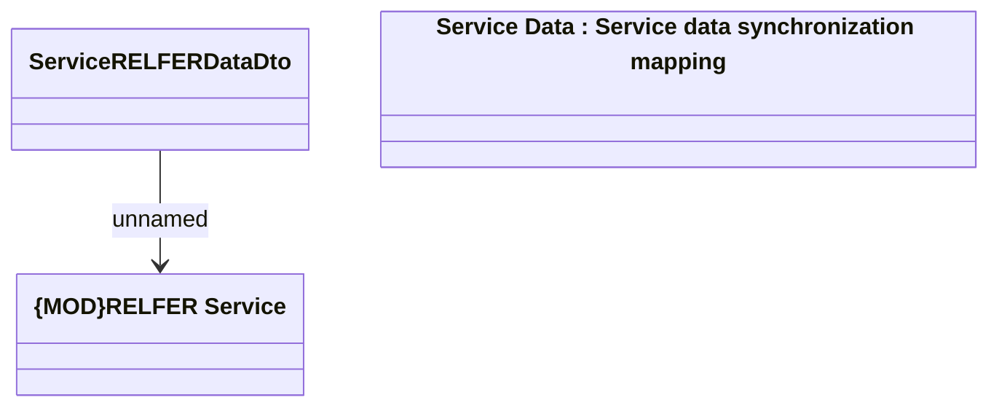

# Service RELFER Data

```mermaid
classDiagram
    class MOD_RELFER_Service["{MOD}RELFER Service"]
    class ServiceRELFERDataDto["ServiceRELFERDataDto"]
    class Service_Data_Service_data_synchronization_mapping["Service Data : Service data synchronization mapping"]
    ServiceRELFERDataDto --> MOD_RELFER_Service : unnamed
```
