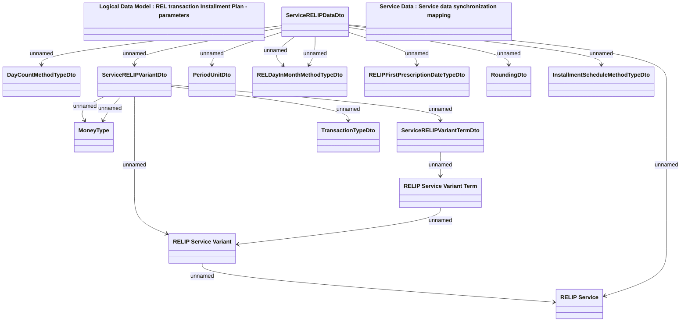

# Service RELIP Data

```mermaid
classDiagram
    class DayCountMethodTypeDto["DayCountMethodTypeDto"]
    class MoneyType["MoneyType"]
    class ServiceRELIPVariantTermDto["ServiceRELIPVariantTermDto"]
    class Logical_Data_Model_REL_transaction_Installment_Plan_paramete["Logical Data Model : REL transaction Installment Plan - parameters"]
    class RELIP_Service["RELIP Service"]
    class ServiceRELIPVariantDto["ServiceRELIPVariantDto"]
    class PeriodUnitDto["PeriodUnitDto"]
    class RELDayInMonthMethodTypeDto["RELDayInMonthMethodTypeDto"]
    class RELIPFirstPrescriptionDateTypeDto["RELIPFirstPrescriptionDateTypeDto"]
    class RoundingDto["RoundingDto"]
    class InstallmentScheduleMethodTypeDto["InstallmentScheduleMethodTypeDto"]
    class TransactionTypeDto["TransactionTypeDto"]
    class RELIP_Service_Variant_Term["RELIP Service Variant Term"]
    class RELIP_Service_Variant["RELIP Service Variant"]
    class ServiceRELIPDataDto["ServiceRELIPDataDto"]
    class Service_Data_Service_data_synchronization_mapping["Service Data : Service data synchronization mapping"]
    ServiceRELIPDataDto --> RELDayInMonthMethodTypeDto : unnamed
    ServiceRELIPVariantDto --> MoneyType : unnamed
    ServiceRELIPVariantDto --> MoneyType : unnamed
    ServiceRELIPVariantDto --> ServiceRELIPVariantTermDto : unnamed
    RELIP_Service_Variant --> RELIP_Service : unnamed
    ServiceRELIPDataDto --> RELIP_Service : unnamed
    ServiceRELIPDataDto --> ServiceRELIPVariantDto : unnamed
    ServiceRELIPDataDto --> DayCountMethodTypeDto : unnamed
    ServiceRELIPDataDto --> RELDayInMonthMethodTypeDto : unnamed
    ServiceRELIPVariantDto --> RELIP_Service_Variant : unnamed
    ServiceRELIPDataDto --> RELIPFirstPrescriptionDateTypeDto : unnamed
    ServiceRELIPDataDto --> RoundingDto : unnamed
    ServiceRELIPDataDto --> InstallmentScheduleMethodTypeDto : unnamed
    ServiceRELIPVariantDto --> TransactionTypeDto : unnamed
    ServiceRELIPVariantTermDto --> RELIP_Service_Variant_Term : unnamed
    RELIP_Service_Variant_Term --> RELIP_Service_Variant : unnamed
    ServiceRELIPDataDto --> PeriodUnitDto : unnamed
```
