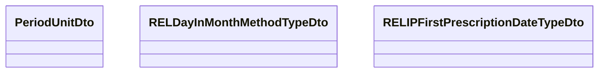

# Service RELIP Types

```mermaid
classDiagram
    class PeriodUnitDto["PeriodUnitDto"]
    class RELDayInMonthMethodTypeDto["RELDayInMonthMethodTypeDto"]
    class RELIPFirstPrescriptionDateTypeDto["RELIPFirstPrescriptionDateTypeDto"]
```
