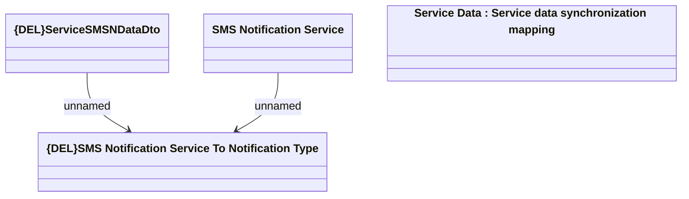

# Service SMSN Data

```mermaid
classDiagram
    class DEL_SMS_Notification_Service_To_Notification_Type["{DEL}SMS Notification Service To Notification Type"]
    class SMS_Notification_Service["SMS Notification Service "]
    class DEL_ServiceSMSNDataDto["{DEL}ServiceSMSNDataDto"]
    class Service_Data_Service_data_synchronization_mapping["Service Data : Service data synchronization mapping"]
    DEL_ServiceSMSNDataDto --> DEL_SMS_Notification_Service_To_Notification_Type : unnamed
    SMS_Notification_Service --> DEL_SMS_Notification_Service_To_Notification_Type : unnamed
```
