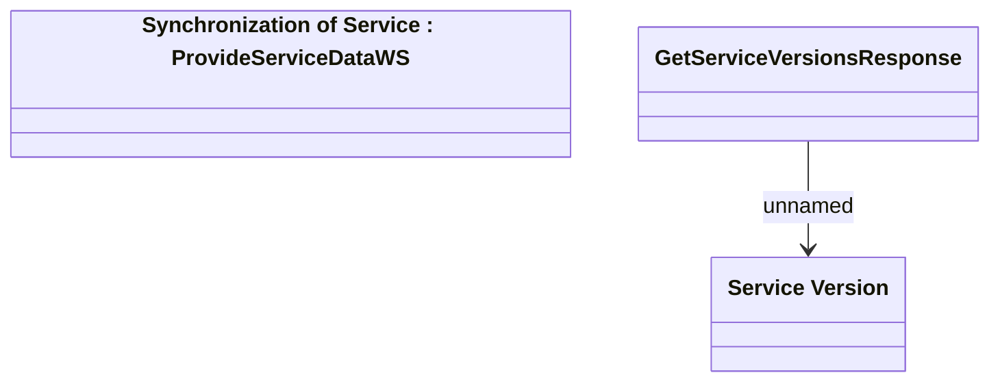

# Service Versions

```mermaid
classDiagram
    class Synchronization_of_Service_ProvideServiceDataWS["Synchronization of Service : ProvideServiceDataWS"]
    class Service_Version["Service Version"]
    class GetServiceVersionsResponse["GetServiceVersionsResponse"]
    GetServiceVersionsResponse --> Service_Version : unnamed
```
