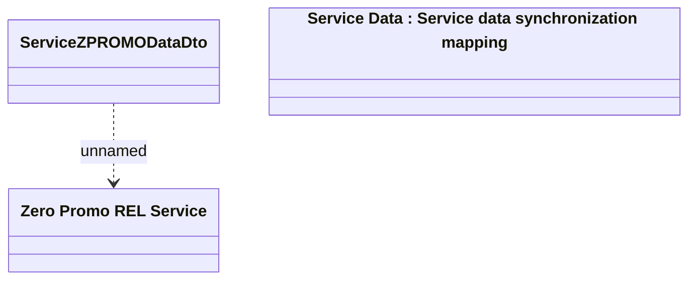

# Service ZPROMO Data

- **Diagram Type**: Logical
- **Package**: HomerSelect/BSL/Modules/Product Catalog (PRC)/Analytical Model/Service/Provided Services/Interface Provided/ProvideServiceDataWS/Service Data/Service ZPROMO Data
- **Diagram ID**: 82984
- **Elements**: 3
- **Connectors**: 1

