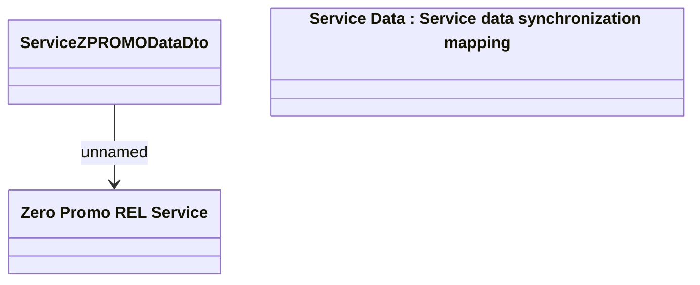

# Service ZPROMO Data

```mermaid
classDiagram
    class Zero_Promo_REL_Service["Zero Promo REL Service"]
    class ServiceZPROMODataDto["ServiceZPROMODataDto"]
    class Service_Data_Service_data_synchronization_mapping["Service Data : Service data synchronization mapping"]
    ServiceZPROMODataDto --> Zero_Promo_REL_Service : unnamed
```
