# Service data synchronization mapping

- **Diagram Type**: Logical
- **Package**: HomerSelect/BSL/Modules/Product Catalog (PRC)/Analytical Model/Service/Provided Services/Interface Provided/ProvideServiceDataWS/Service Data
- **Diagram ID**: 121713
- **Elements**: 65
- **Connectors**: 36

```mermaid
classDiagram
    class diagram_930C9694_65FA_4a6a_96B4_A49FE0CFE51E["$diagram://{930C9694-65FA-4a6a-96B4-A49FE0CFE51E}"]
    class MOD_ServicePREFDDDataDto["{MOD}ServicePREFDDDataDto"]
    class diagram_F4830F8B_B99C_4d45_89E3_445E63F8B159["$diagram://{F4830F8B-B99C-4d45-89E3-445E63F8B159}"]
    class Quaification_criteria["Quaification criteria"]
    class ADD_ServiceMTCACCData["{ADD}ServiceMTCACCData "]
    class ADD_Qualification_criteria_type["{ADD}Qualification criteria type"]
    class ADD_ServiceACCSTMTData["{ADD}ServiceACCSTMTData "]
    class ADD_Service_ACCSTMT_Data_Service_ACCSTMT_Data["{ADD}Service ACCSTMT Data : Service ACCSTMT Data"]
    class diagram_A988DFDF_66B5_4be7_A1E1_9AB5959A328D["$diagram://{A988DFDF-66B5-4be7-A1E1-9AB5959A328D}"]
    class ServiceRELPAYHOLDataDto["ServiceRELPAYHOLDataDto"]
    class Service_RELFER_Data_Service_RELFER_Data["Service RELFER Data : Service RELFER Data"]
    class ServiceRELFERDataDto["ServiceRELFERDataDto"]
    class Service_IPPACK_Data_Service_IPPACK_Data["Service IPPACK Data : Service IPPACK Data"]
    class MOD_ServiceIPPACKDataDto["{MOD}ServiceIPPACKDataDto"]
    class Service_Relation["Service Relation"]
    class MOD_ServiceCELREWDataDto["{MOD}ServiceCELREWDataDto"]
    class Service_CELREW_Data_Service_CELREW_Data["Service CELREW Data : Service CELREW Data"]
    class ServiceTypeCategoryDto["ServiceTypeCategoryDto"]
    class Service_PAYHOL_Data_Service_PAYHOL_Data["Service PAYHOL Data : Service PAYHOL Data"]
    class ServicePAYHOLDataDto["ServicePAYHOLDataDto"]
    class Service_PER_Data_Service_PER_Data["Service PER Data : Service PER Data"]
    class ServicePERDataDto["ServicePERDataDto"]
    class Service_LRES_Data_Service_LRES_Data["Service LRES Data : Service LRES Data"]
    class ServiceLRESDataDto["ServiceLRESDataDto"]
    class Service_GRACE_Data_Service_GRPER_Data["Service GRACE Data :Service GRPER Data"]
    class ServiceGRPERDataDto["ServiceGRPERDataDto"]
    class Service_GIFTP_Data_Service_GIFTP_Data["Service GIFTP Data : Service GIFTP Data"]
    class ServiceGIFTPDataDto["ServiceGIFTPDataDto"]
    class Service_FER_Data_Service_FER_Data["Service FER Data : Service FER Data"]
    class MOD_ServiceFERDataDto["{MOD}ServiceFERDataDto"]
    class Service_FBACK_Data_Service_FBACK_Data["Service FBACK Data : Service FBACK Data"]
    class ServiceFBACKDataDto["ServiceFBACKDataDto"]
    class Service_DEFP_Data_Service_DEFP_Data["Service DEFP Data : Service DEFP Data"]
    class ServiceDEFPDataDto["ServiceDEFPDataDto"]
    class Service_COP_Data_Service_COP_Data["Service COP Data : Service COP Data"]
    class MOD_ServiceCOPDataDto["{MOD}ServiceCOPDataDto"]
    class Service_CET_Data_Service_CET_Data["Service CET Data : Service CET Data"]
    class MOD_ServiceCETDataDto["{MOD}ServiceCETDataDto"]
    class Service_CONS_Data_Service_CONS_Data["Service CONS Data : Service CONS Data"]
    class ServiceCONSDataDto["ServiceCONSDataDto"]
    class Service_CHECKTL_Data_Service_CHECKTL_Data["Service CHECKTL Data : Service CHECKTL Data"]
    class ServiceCHECKTLDataDto["ServiceCHECKTLDataDto"]
    class Service_CHDDR_Data_Service_CHDDR_Data["Service CHDDR Data : Service CHDDR Data"]
    class ServiceCHDDRDataDto["ServiceCHDDRDataDto"]
    class Service_CHDD_Data_Service_CHDD_Data["Service CHDD Data : Service CHDD Data"]
    class ServiceCHDDDataDto["ServiceCHDDDataDto"]
    class Service_INSURANCE_Data_Service_INSURANCE_Data["Service INSURANCE Data : Service INSURANCE Data"]
    class MOD_ServiceINSURANCEDataDto["{MOD}ServiceINSURANCEDataDto"]
    class Service_LOYALTY_Data_Service_LOYALTY_Data["Service LOYALTY Data : Service LOYALTY Data"]
    class ServiceLOYALTYDataDto["ServiceLOYALTYDataDto"]
    class Service_ZPROMO_Data_Service_ZPROMO_Data["Service ZPROMO Data : Service ZPROMO Data"]
    class Service_SMSN_Data_Service_SMSN_Data["Service SMSN Data : Service SMSN Data"]
    class Service_RELIP_Data_Service_RELIP_Data["Service RELIP Data : Service RELIP Data"]
    class Service_GRREL_Data_Service_GRREL_Data["Service GRREL Data : Service GRREL Data"]
    class Service_CRDPST_Data_Service_CRDPST_Data["Service CRDPST Data : Service CRDPST Data"]
    class ServiceRELIPDataDto["ServiceRELIPDataDto"]
    class ServiceCRDPSTDataDto["ServiceCRDPSTDataDto"]
    class DEL_ServiceSMSNDataDto["{DEL}ServiceSMSNDataDto"]
    class ServiceZPROMODataDto["ServiceZPROMODataDto"]
    class MOD_ServiceTypeDataDto["{MOD}ServiceTypeDataDto"]
    class ServiceGRRELDataDto["ServiceGRRELDataDto"]
    class Service["Service"]
    class ServiceCommonDataDto["ServiceCommonDataDto"]
    class Synchronization_of_Service_ProvideServiceDataWS["Synchronization of Service : ProvideServiceDataWS"]
    class GetServiceDataResponse["GetServiceDataResponse"]
    ServiceCommonDataDto ..> ServiceTypeCategoryDto : unnamed
    ServiceCommonDataDto ..> Quaification_criteria : unnamed
    MOD_ServiceTypeDataDto ..> ServiceFBACKDataDto : unnamed
    MOD_ServiceTypeDataDto ..> MOD_ServiceFERDataDto : unnamed
    MOD_ServiceTypeDataDto ..> ServiceGIFTPDataDto : unnamed
    MOD_ServiceTypeDataDto ..> ServiceGRPERDataDto : unnamed
    MOD_ServiceTypeDataDto ..> ServiceLRESDataDto : unnamed
    MOD_ServiceTypeDataDto ..> MOD_ServiceCOPDataDto : unnamed
    MOD_ServiceTypeDataDto ..> ServicePAYHOLDataDto : unnamed
    MOD_ServiceTypeDataDto ..> MOD_ServiceCETDataDto : unnamed
    MOD_ServiceTypeDataDto ..> MOD_ServiceCELREWDataDto : unnamed
    MOD_ServiceTypeDataDto ..> MOD_ServiceIPPACKDataDto : unnamed
    MOD_ServiceTypeDataDto ..> ServiceRELFERDataDto : unnamed
    MOD_ServiceTypeDataDto ..> ServiceRELPAYHOLDataDto : unnamed
    MOD_ServiceTypeDataDto ..> ADD_ServiceACCSTMTData : unnamed
    MOD_ServiceTypeDataDto ..> ADD_ServiceMTCACCData : unnamed
    MOD_ServiceTypeDataDto ..> ServicePERDataDto : unnamed
    MOD_ServiceTypeDataDto ..> ServiceCRDPSTDataDto : unnamed
    GetServiceDataResponse ..> ServiceCommonDataDto : unnamed
    ServiceCommonDataDto ..> Service : unnamed
    MOD_ServiceTypeDataDto ..> ServiceGRRELDataDto : unnamed
    ServiceCommonDataDto --> MOD_ServiceTypeDataDto : unnamed
    MOD_ServiceTypeDataDto ..> ServiceDEFPDataDto : unnamed
    MOD_ServiceTypeDataDto ..> DEL_ServiceSMSNDataDto : unnamed
    MOD_ServiceTypeDataDto ..> MOD_ServicePREFDDDataDto : unnamed
    MOD_ServiceTypeDataDto ..> ServiceRELIPDataDto : unnamed
    MOD_ServiceTypeDataDto ..> ServiceLOYALTYDataDto : unnamed
    MOD_ServiceTypeDataDto ..> MOD_ServiceINSURANCEDataDto : unnamed
    MOD_ServiceTypeDataDto ..> ServiceCHDDDataDto : unnamed
    MOD_ServiceTypeDataDto ..> ServiceCHDDRDataDto : unnamed
    MOD_ServiceTypeDataDto ..> ServiceCHECKTLDataDto : unnamed
    MOD_ServiceTypeDataDto ..> ServiceCONSDataDto : unnamed
    MOD_ServiceTypeDataDto ..> ServiceZPROMODataDto : unnamed
    Quaification_criteria ..> ADD_Qualification_criteria_type : unnamed
    Service_Relation ..> Service : unnamed
    Service_Relation ..> Service : unnamed
```

