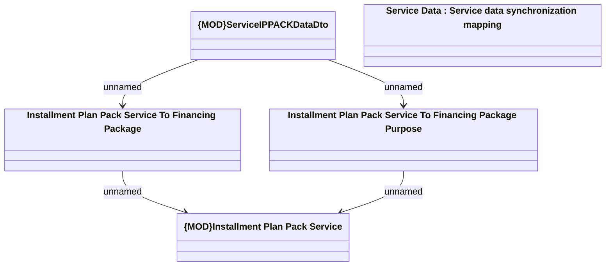

# {MOD}Service IPPACK Data

```mermaid
classDiagram
    class Installment_Plan_Pack_Service_To_Financing_Package["Installment Plan Pack Service To Financing Package"]
    class Installment_Plan_Pack_Service_To_Financing_Package_Purpose["Installment Plan Pack Service To Financing Package Purpose"]
    class MOD_ServiceIPPACKDataDto["{MOD}ServiceIPPACKDataDto"]
    class MOD_Installment_Plan_Pack_Service["{MOD}Installment Plan Pack Service "]
    class Service_Data_Service_data_synchronization_mapping["Service Data : Service data synchronization mapping"]
    MOD_ServiceIPPACKDataDto --> Installment_Plan_Pack_Service_To_Financing_Package_Purpose : unnamed
    MOD_ServiceIPPACKDataDto --> Installment_Plan_Pack_Service_To_Financing_Package : unnamed
    Installment_Plan_Pack_Service_To_Financing_Package --> MOD_Installment_Plan_Pack_Service : unnamed
    Installment_Plan_Pack_Service_To_Financing_Package_Purpose --> MOD_Installment_Plan_Pack_Service : unnamed
```
