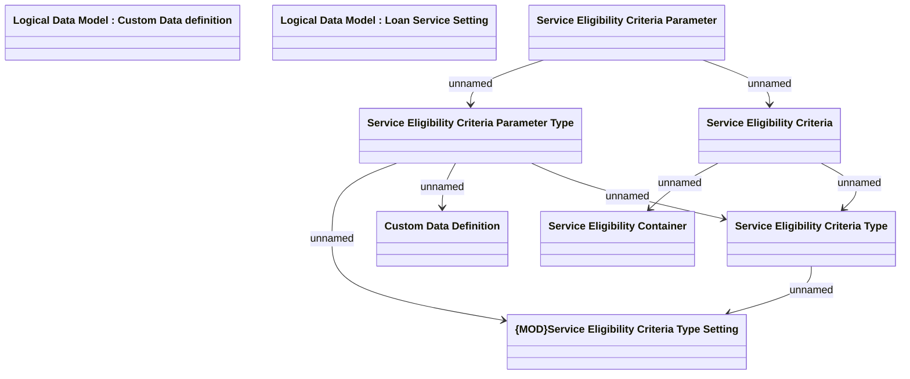

# Service Eligibility

```mermaid
classDiagram
    class MOD_Service_Eligibility_Criteria_Type_Setting["{MOD}Service Eligibility Criteria Type Setting"]
    class Custom_Data_Definition["Custom Data Definition"]
    class Logical_Data_Model_Custom_Data_definition["Logical Data Model : Custom Data definition"]
    class Logical_Data_Model_Loan_Service_Setting["Logical Data Model : Loan Service Setting"]
    class Service_Eligibility_Container["Service Eligibility Container"]
    class Service_Eligibility_Criteria_Parameter_Type["Service Eligibility Criteria Parameter Type "]
    class Service_Eligibility_Criteria_Type["Service Eligibility Criteria Type"]
    class Service_Eligibility_Criteria_Parameter["Service Eligibility Criteria Parameter"]
    class Service_Eligibility_Criteria["Service Eligibility Criteria"]
    Service_Eligibility_Criteria --> Service_Eligibility_Container : unnamed
    Service_Eligibility_Criteria --> Service_Eligibility_Criteria_Type : unnamed
    Service_Eligibility_Criteria_Parameter --> Service_Eligibility_Criteria_Parameter_Type : unnamed
    Service_Eligibility_Criteria_Parameter --> Service_Eligibility_Criteria : unnamed
    Service_Eligibility_Criteria_Type --> MOD_Service_Eligibility_Criteria_Type_Setting : unnamed
    Service_Eligibility_Criteria_Parameter_Type --> MOD_Service_Eligibility_Criteria_Type_Setting : unnamed
    Service_Eligibility_Criteria_Parameter_Type --> Custom_Data_Definition : unnamed
    Service_Eligibility_Criteria_Parameter_Type --> Service_Eligibility_Criteria_Type : unnamed
```
