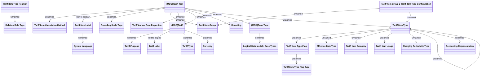

# Tariff and Tariff Item Management

```mermaid
classDiagram
    class Tariff_Label["Tariff Label"]
    class System_Language["System Language"]
    class Tariff_Item_Label["Tariff Item Label"]
    class Tariff_Item_Group_2_Tariff_Item_Type_Configuration["Tariff Item Group 2 Tariff Item Type Configuration"]
    class Rounding_Scale_Type["Rounding Scale Type"]
    class Tariff_Purpose["Tariff Purpose"]
    class Tariff_Item_Type_Flag["Tariff Item Type Flag"]
    class Tariff_Item_Type_Flag_Type["Tariff Item Type Flag Type"]
    class Relation_Role_Type["Relation Role Type"]
    class Tariff_Item_Type_Relation["Tariff Item Type Relation"]
    class Logical_Data_Model_Base_Types["Logical Data Model : Base Types"]
    class Tariff_Item_Group["Tariff Item Group"]
    class Effective_Date_Type["Effective Date Type"]
    class Accounting_Representation["Accounting Representation"]
    class Tariff_Annual_Rate_Projection["Tariff Annual Rate Projection"]
    class Tariff_Item_Calculation_Method["Tariff Item Calculation Method"]
    class Tariff_Item_Category["Tariff Item Category"]
    class Tariff_Item_Usage["Tariff Item Usage"]
    class Charging_Periodicity_Type["Charging Periodicity Type"]
    class Rounding["Rounding"]
    class MOD_Base_Type["{MOD}Base Type"]
    class Tariff_Type["Tariff Type"]
    class Currency["Currency"]
    class Tariff_Item_Type["Tariff Item Type"]
    class MOD_Tariff_Item["{MOD}Tariff Item"]
    class MOD_Tariff["{MOD}Tariff"]
    MOD_Tariff_Item --> Tariff_Item_Calculation_Method : unnamed
    Tariff_Item_Label --> System_Language : unnamed
    MOD_Tariff_Item --> Tariff_Item_Label : Text to display
    MOD_Tariff_Item --> Rounding_Scale_Type : unnamed
    MOD_Tariff --> Tariff_Purpose : unnamed
    Tariff_Item_Type --> Tariff_Item_Type_Flag : unnamed
    Tariff_Item_Type_Flag --> Tariff_Item_Type_Flag_Type : unnamed
    Tariff_Item_Type_Relation --> Relation_Role_Type : unnamed
    MOD_Tariff_Item --> Tariff_Item_Group : unnamed
    Tariff_Item_Group_2_Tariff_Item_Type_Configuration --> Tariff_Item_Group : unnamed
    Tariff_Item_Type --> Effective_Date_Type : unnamed
    MOD_Tariff --> Tariff_Label : Text to display
    MOD_Tariff_Item --> Tariff_Annual_Rate_Projection : unnamed
    MOD_Tariff_Item --> MOD_Tariff : unnamed
    Tariff_Item_Type --> Tariff_Item_Category : unnamed
    Tariff_Item_Type --> Tariff_Item_Usage : unnamed
    Tariff_Item_Type --> Charging_Periodicity_Type : unnamed
    MOD_Tariff_Item --> Rounding : unnamed
    MOD_Tariff_Item --> MOD_Base_Type : unnamed
    MOD_Tariff --> Tariff_Type : unnamed
    MOD_Tariff --> Currency : unnamed
    Tariff_Item_Type --> Tariff_Item_Type : unnamed
    Tariff_Item_Group_2_Tariff_Item_Type_Configuration --> Tariff_Item_Type : unnamed
    MOD_Tariff_Item --> Tariff_Item_Type : unnamed
    Tariff_Item_Type --> Accounting_Representation : unnamed
    MOD_Base_Type --> Logical_Data_Model_Base_Types : unnamed
```
