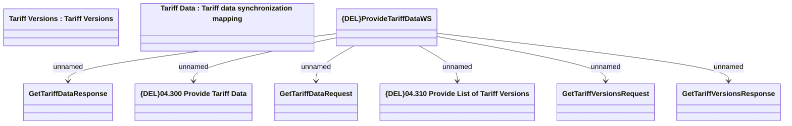

# ProvideTariffDataWS

```mermaid
classDiagram
    class Tariff_Versions_Tariff_Versions["Tariff Versions : Tariff Versions"]
    class Tariff_Data_Tariff_data_synchronization_mapping["Tariff Data : Tariff data synchronization mapping"]
    class GetTariffVersionsResponse["GetTariffVersionsResponse"]
    class GetTariffVersionsRequest["GetTariffVersionsRequest"]
    class DEL_04_310_Provide_List_of_Tariff_Versions["{DEL}04.310 Provide List of Tariff Versions"]
    class GetTariffDataRequest["GetTariffDataRequest"]
    class DEL_04_300_Provide_Tariff_Data["{DEL}04.300 Provide Tariff Data"]
    class GetTariffDataResponse["GetTariffDataResponse"]
    class DEL_ProvideTariffDataWS["{DEL}ProvideTariffDataWS"]
    DEL_ProvideTariffDataWS --> GetTariffDataResponse : unnamed
    DEL_ProvideTariffDataWS --> DEL_04_300_Provide_Tariff_Data : unnamed
    DEL_ProvideTariffDataWS --> GetTariffDataRequest : unnamed
    DEL_ProvideTariffDataWS --> DEL_04_310_Provide_List_of_Tariff_Versions : unnamed
    DEL_ProvideTariffDataWS --> GetTariffVersionsRequest : unnamed
    DEL_ProvideTariffDataWS --> GetTariffVersionsResponse : unnamed
```
