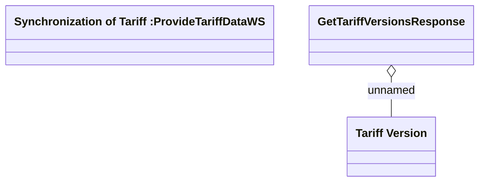

# Tariff Versions

- **Diagram Type**: Logical
- **Package**: HomerSelect/BSL/Modules/Product Catalog (PRC)/Analytical Model/Tariff/Provided Services/Interface Provided/ProvideTariffDataWS/Tariff Versions
- **Diagram ID**: 92427
- **Elements**: 3
- **Connectors**: 1

