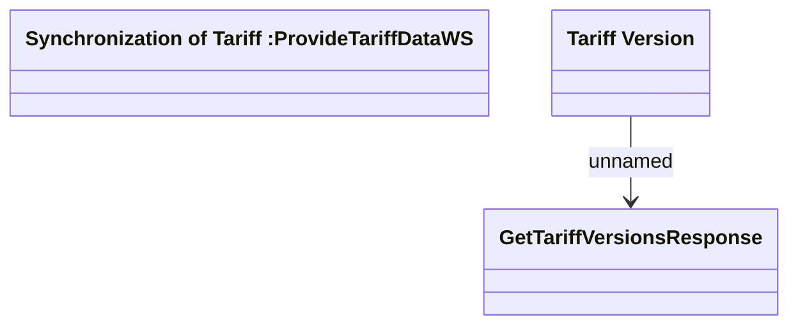

# Tariff Versions

```mermaid
classDiagram
    class Synchronization_of_Tariff_ProvideTariffDataWS["Synchronization of Tariff :ProvideTariffDataWS"]
    class Tariff_Version["Tariff Version"]
    class GetTariffVersionsResponse["GetTariffVersionsResponse"]
    Tariff_Version --> GetTariffVersionsResponse : unnamed
```
