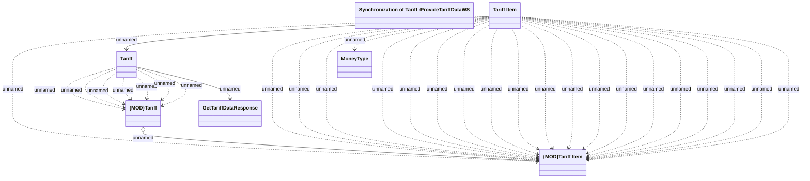

# Tariff data synchronization mapping

- **Diagram Type**: Logical
- **Package**: HomerSelect/BSL/Modules/Product Catalog (PRC)/Analytical Model/Tariff/Provided Services/Interface Provided/ProvideTariffDataWS/Tariff Data
- **Diagram ID**: 92411
- **Elements**: 7
- **Connectors**: 31

