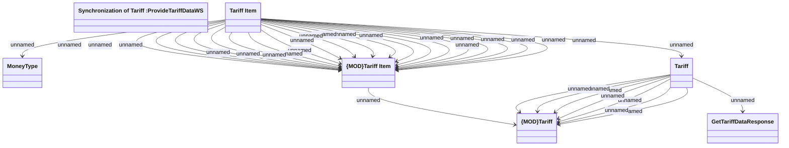

# Tariff data synchronization mapping

```mermaid
classDiagram
    class Synchronization_of_Tariff_ProvideTariffDataWS["Synchronization of Tariff :ProvideTariffDataWS"]
    class MoneyType["MoneyType"]
    class MOD_Tariff["{MOD}Tariff"]
    class Tariff["Tariff"]
    class Tariff_Item["Tariff Item"]
    class GetTariffDataResponse["GetTariffDataResponse"]
    class MOD_Tariff_Item["{MOD}Tariff Item"]
    Tariff_Item --> MOD_Tariff_Item : unnamed
    Tariff --> MOD_Tariff : unnamed
    Tariff --> MOD_Tariff : unnamed
    Tariff --> MOD_Tariff : unnamed
    Tariff --> MOD_Tariff : unnamed
    Tariff --> MOD_Tariff : unnamed
    Tariff --> MOD_Tariff : unnamed
    Tariff --> MOD_Tariff : unnamed
    Tariff_Item --> Tariff : unnamed
    Tariff --> GetTariffDataResponse : unnamed
    Tariff_Item --> MOD_Tariff_Item : unnamed
    Tariff_Item --> MOD_Tariff_Item : unnamed
    Tariff_Item --> MOD_Tariff_Item : unnamed
    Tariff_Item --> MoneyType : unnamed
    Tariff_Item --> MOD_Tariff_Item : unnamed
    Tariff_Item --> MOD_Tariff_Item : unnamed
    Tariff_Item --> MOD_Tariff_Item : unnamed
    Tariff_Item --> MOD_Tariff_Item : unnamed
    Tariff_Item --> MOD_Tariff_Item : unnamed
    Tariff_Item --> MOD_Tariff_Item : unnamed
    Tariff_Item --> MOD_Tariff_Item : unnamed
    Tariff_Item --> MOD_Tariff_Item : unnamed
    Tariff_Item --> MOD_Tariff_Item : unnamed
    Tariff_Item --> MOD_Tariff_Item : unnamed
    Tariff_Item --> MOD_Tariff_Item : unnamed
    Tariff_Item --> MOD_Tariff_Item : unnamed
    Tariff_Item --> MOD_Tariff_Item : unnamed
    Tariff_Item --> MOD_Tariff_Item : unnamed
    Tariff_Item --> MOD_Tariff_Item : unnamed
    Tariff_Item --> MOD_Tariff_Item : unnamed
    MOD_Tariff_Item --> MOD_Tariff : unnamed
```
