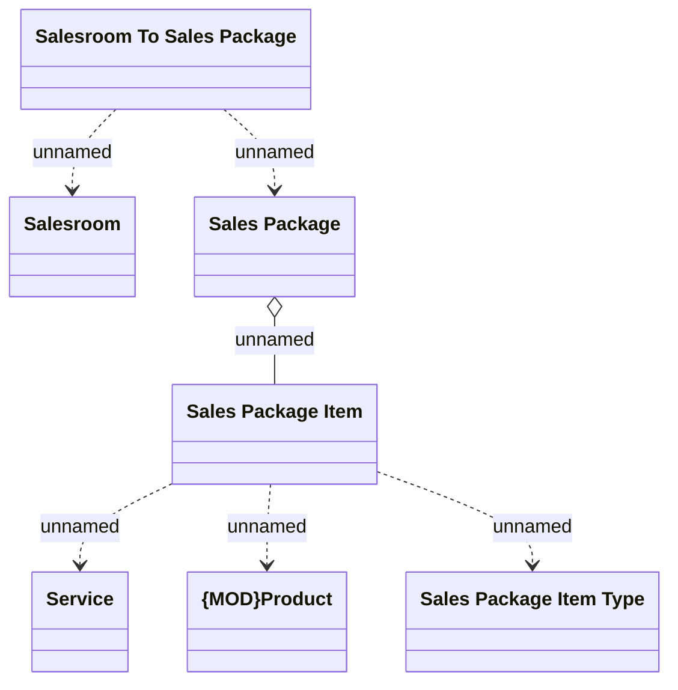

# Sales Package

- **Diagram Type**: Logical
- **Package**: HomerSelect/BSL/Modules/Product Catalog (PRC)/Analytical Model/{ADD}Sales Package/COMMON for Sales Package/Logical Data Model
- **Diagram ID**: 104974
- **Elements**: 7
- **Connectors**: 6

