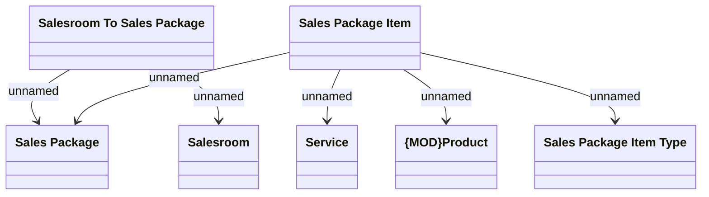

# Sales Package

```mermaid
classDiagram
    class Salesroom["Salesroom"]
    class Salesroom_To_Sales_Package["Salesroom To Sales Package"]
    class Sales_Package_Item_Type["Sales Package Item Type"]
    class Sales_Package_Item["Sales Package Item"]
    class MOD_Product["{MOD}Product"]
    class Service["Service"]
    class Sales_Package["Sales Package"]
    Salesroom_To_Sales_Package --> Sales_Package : unnamed
    Sales_Package_Item --> Sales_Package : unnamed
    Sales_Package_Item --> Service : unnamed
    Sales_Package_Item --> MOD_Product : unnamed
    Sales_Package_Item --> Sales_Package_Item_Type : unnamed
    Salesroom_To_Sales_Package --> Salesroom : unnamed
```
