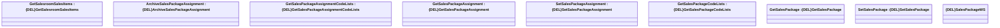

# SalesPackageWS

```mermaid
classDiagram
    class GetSalesroomSalesItems_DEL_GetSalesroomSalesItems["GetSalesroomSalesItems :{DEL}GetSalesroomSalesItems"]
    class ArchiveSalesPackageAssignment_DEL_ArchiveSalesPackageAssignm["ArchiveSalesPackageAssignment :{DEL}ArchiveSalesPackageAssignment"]
    class GetSalesPackageAssignmentCodeLists_DEL_GetSalesPackageAssign["GetSalesPackageAssignmentCodeLists :{DEL}GetSalesPackageAssignmentCodeLists"]
    class GetSalesPackageAssignment_DEL_GetSalesPackageAssignment["GetSalesPackageAssignment :{DEL}GetSalesPackageAssignment"]
    class SetSalesPackageAssignment_DEL_SetSalesPackageAssignment["SetSalesPackageAssignment :{DEL}SetSalesPackageAssignment"]
    class GetSalesPackageCodeLists_DEL_GetSalesPackageCodeLists["GetSalesPackageCodeLists :{DEL}GetSalesPackageCodeLists"]
    class GetSalesPackage_DEL_GetSalesPackage["GetSalesPackage :{DEL}GetSalesPackage"]
    class SetSalesPackage_DEL_SetSalesPackage["SetSalesPackage :{DEL}SetSalesPackage"]
    class DEL_SalesPackageWS["{DEL}SalesPackageWS"]
```
