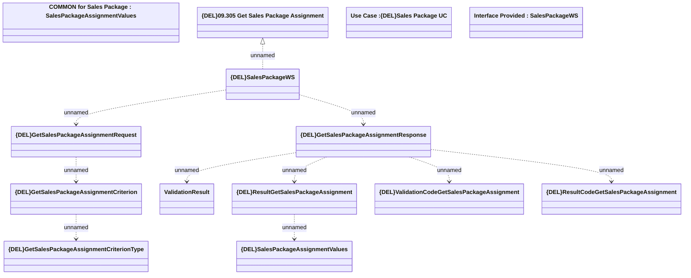

# GetSalesPackageAssignment

- **Diagram Type**: Logical
- **Package**: HomerSelect/BSL/Modules/Product Catalog (PRC)/Analytical Model/{ADD}Sales Package/Provided Services/Interface Provided/{DEL}GetSalesPackageAssignment
- **Diagram ID**: 154019
- **Elements**: 14
- **Connectors**: 10

