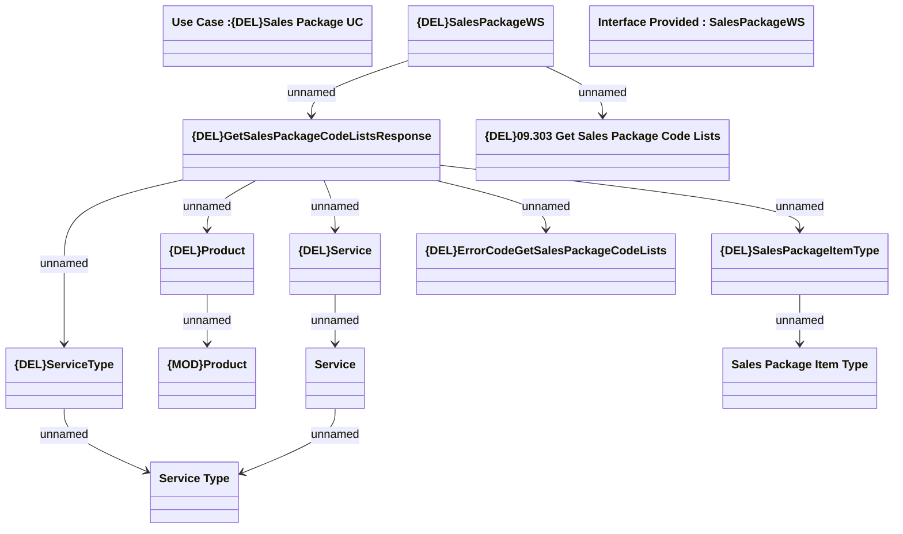

# GetSalesPackageCodeLists

```mermaid
classDiagram
    class Service_Type["Service Type"]
    class DEL_ServiceType["{DEL}ServiceType"]
    class DEL_Service["{DEL}Service"]
    class MOD_Product["{MOD}Product"]
    class Service["Service"]
    class DEL_Product["{DEL}Product"]
    class DEL_SalesPackageItemType["{DEL}SalesPackageItemType"]
    class DEL_ErrorCodeGetSalesPackageCodeLists["{DEL}ErrorCodeGetSalesPackageCodeLists"]
    class Sales_Package_Item_Type["Sales Package Item Type"]
    class DEL_GetSalesPackageCodeListsResponse["{DEL}GetSalesPackageCodeListsResponse"]
    class DEL_09_303_Get_Sales_Package_Code_Lists["{DEL}09.303 Get Sales Package Code Lists"]
    class Use_Case_DEL_Sales_Package_UC["Use Case :{DEL}Sales Package UC"]
    class DEL_SalesPackageWS["{DEL}SalesPackageWS"]
    class Interface_Provided_SalesPackageWS["Interface Provided : SalesPackageWS"]
    DEL_SalesPackageWS --> DEL_09_303_Get_Sales_Package_Code_Lists : unnamed
    DEL_SalesPackageWS --> DEL_GetSalesPackageCodeListsResponse : unnamed
    DEL_SalesPackageItemType --> Sales_Package_Item_Type : unnamed
    DEL_GetSalesPackageCodeListsResponse --> DEL_ErrorCodeGetSalesPackageCodeLists : unnamed
    DEL_GetSalesPackageCodeListsResponse --> DEL_SalesPackageItemType : unnamed
    DEL_GetSalesPackageCodeListsResponse --> DEL_Product : unnamed
    DEL_Service --> Service : unnamed
    DEL_Product --> MOD_Product : unnamed
    DEL_GetSalesPackageCodeListsResponse --> DEL_Service : unnamed
    DEL_GetSalesPackageCodeListsResponse --> DEL_ServiceType : unnamed
    DEL_ServiceType --> Service_Type : unnamed
    Service --> Service_Type : unnamed
```
