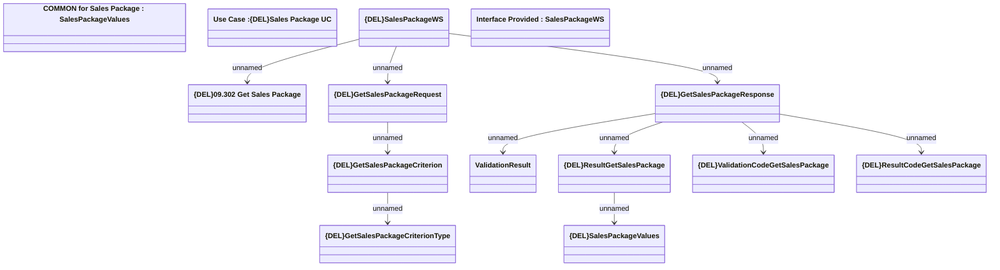

# GetSalesPackage

```mermaid
classDiagram
    class COMMON_for_Sales_Package_SalesPackageValues["COMMON for Sales Package : SalesPackageValues"]
    class DEL_SalesPackageValues["{DEL}SalesPackageValues"]
    class DEL_ResultCodeGetSalesPackage["{DEL}ResultCodeGetSalesPackage"]
    class DEL_ValidationCodeGetSalesPackage["{DEL}ValidationCodeGetSalesPackage"]
    class DEL_ResultGetSalesPackage["{DEL}ResultGetSalesPackage"]
    class DEL_GetSalesPackageResponse["{DEL}GetSalesPackageResponse"]
    class DEL_GetSalesPackageCriterionType["{DEL}GetSalesPackageCriterionType"]
    class DEL_GetSalesPackageCriterion["{DEL}GetSalesPackageCriterion"]
    class DEL_GetSalesPackageRequest["{DEL}GetSalesPackageRequest"]
    class Use_Case_DEL_Sales_Package_UC["Use Case :{DEL}Sales Package UC"]
    class DEL_09_302_Get_Sales_Package["{DEL}09.302 Get Sales Package"]
    class DEL_SalesPackageWS["{DEL}SalesPackageWS"]
    class Interface_Provided_SalesPackageWS["Interface Provided : SalesPackageWS"]
    class ValidationResult["ValidationResult"]
    DEL_GetSalesPackageResponse --> ValidationResult : unnamed
    DEL_SalesPackageWS --> DEL_09_302_Get_Sales_Package : unnamed
    DEL_SalesPackageWS --> DEL_GetSalesPackageRequest : unnamed
    DEL_GetSalesPackageRequest --> DEL_GetSalesPackageCriterion : unnamed
    DEL_GetSalesPackageCriterion --> DEL_GetSalesPackageCriterionType : unnamed
    DEL_SalesPackageWS --> DEL_GetSalesPackageResponse : unnamed
    DEL_GetSalesPackageResponse --> DEL_ResultGetSalesPackage : unnamed
    DEL_GetSalesPackageResponse --> DEL_ValidationCodeGetSalesPackage : unnamed
    DEL_GetSalesPackageResponse --> DEL_ResultCodeGetSalesPackage : unnamed
    DEL_ResultGetSalesPackage --> DEL_SalesPackageValues : unnamed
```
