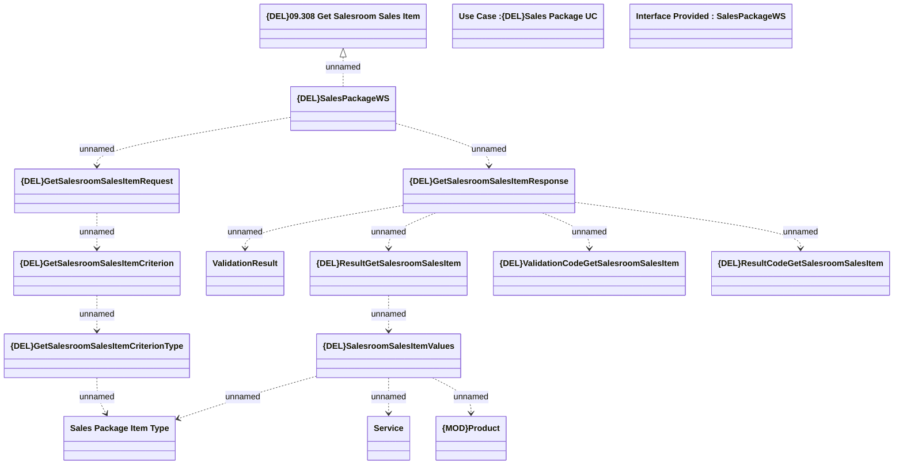

# GetSalesroomSalesItems

- **Diagram Type**: Logical
- **Package**: HomerSelect/BSL/Modules/Product Catalog (PRC)/Analytical Model/{ADD}Sales Package/Provided Services/Interface Provided/{DEL}GetSalesroomSalesItem
- **Diagram ID**: 154022
- **Elements**: 16
- **Connectors**: 14

