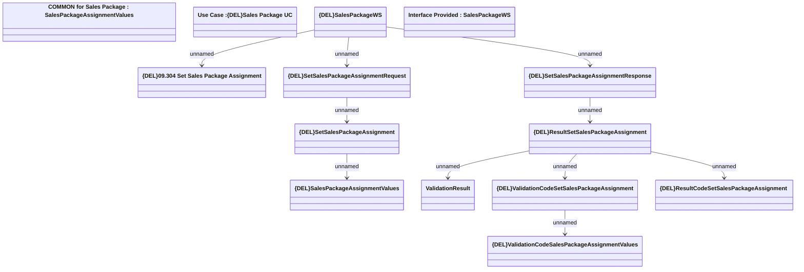

# SetSalesPackageAssignment

```mermaid
classDiagram
    class DEL_ResultCodeSetSalesPackageAssignment["{DEL}ResultCodeSetSalesPackageAssignment "]
    class DEL_ValidationCodeSetSalesPackageAssignment["{DEL}ValidationCodeSetSalesPackageAssignment"]
    class DEL_ResultSetSalesPackageAssignment["{DEL}ResultSetSalesPackageAssignment"]
    class DEL_SetSalesPackageAssignmentResponse["{DEL}SetSalesPackageAssignmentResponse"]
    class DEL_ValidationCodeSalesPackageAssignmentValues["{DEL}ValidationCodeSalesPackageAssignmentValues"]
    class COMMON_for_Sales_Package_SalesPackageAssignmentValues["COMMON for Sales Package : SalesPackageAssignmentValues"]
    class DEL_SalesPackageAssignmentValues["{DEL}SalesPackageAssignmentValues"]
    class DEL_SetSalesPackageAssignment["{DEL}SetSalesPackageAssignment"]
    class DEL_SetSalesPackageAssignmentRequest["{DEL}SetSalesPackageAssignmentRequest"]
    class DEL_09_304_Set_Sales_Package_Assignment["{DEL}09.304 Set Sales Package Assignment"]
    class Use_Case_DEL_Sales_Package_UC["Use Case :{DEL}Sales Package UC"]
    class DEL_SalesPackageWS["{DEL}SalesPackageWS"]
    class Interface_Provided_SalesPackageWS["Interface Provided : SalesPackageWS"]
    class ValidationResult["ValidationResult"]
    DEL_ResultSetSalesPackageAssignment --> ValidationResult : unnamed
    DEL_SalesPackageWS --> DEL_09_304_Set_Sales_Package_Assignment : unnamed
    DEL_SalesPackageWS --> DEL_SetSalesPackageAssignmentRequest : unnamed
    DEL_SetSalesPackageAssignmentRequest --> DEL_SetSalesPackageAssignment : unnamed
    DEL_SetSalesPackageAssignment --> DEL_SalesPackageAssignmentValues : unnamed
    DEL_ValidationCodeSetSalesPackageAssignment --> DEL_ValidationCodeSalesPackageAssignmentValues : unnamed
    DEL_SalesPackageWS --> DEL_SetSalesPackageAssignmentResponse : unnamed
    DEL_SetSalesPackageAssignmentResponse --> DEL_ResultSetSalesPackageAssignment : unnamed
    DEL_ResultSetSalesPackageAssignment --> DEL_ValidationCodeSetSalesPackageAssignment : unnamed
    DEL_ResultSetSalesPackageAssignment --> DEL_ResultCodeSetSalesPackageAssignment : unnamed
```
