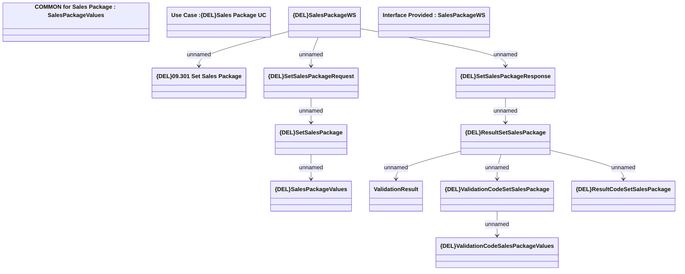

# SetSalesPackage

```mermaid
classDiagram
    class COMMON_for_Sales_Package_SalesPackageValues["COMMON for Sales Package : SalesPackageValues"]
    class DEL_ResultCodeSetSalesPackage["{DEL}ResultCodeSetSalesPackage "]
    class DEL_ValidationCodeSetSalesPackage["{DEL}ValidationCodeSetSalesPackage"]
    class DEL_ResultSetSalesPackage["{DEL}ResultSetSalesPackage"]
    class DEL_SetSalesPackageResponse["{DEL}SetSalesPackageResponse"]
    class DEL_ValidationCodeSalesPackageValues["{DEL}ValidationCodeSalesPackageValues"]
    class DEL_SalesPackageValues["{DEL}SalesPackageValues"]
    class DEL_SetSalesPackage["{DEL}SetSalesPackage"]
    class DEL_SetSalesPackageRequest["{DEL}SetSalesPackageRequest"]
    class Use_Case_DEL_Sales_Package_UC["Use Case :{DEL}Sales Package UC"]
    class DEL_09_301_Set_Sales_Package["{DEL}09.301 Set Sales Package"]
    class DEL_SalesPackageWS["{DEL}SalesPackageWS"]
    class Interface_Provided_SalesPackageWS["Interface Provided : SalesPackageWS"]
    class ValidationResult["ValidationResult"]
    DEL_ResultSetSalesPackage --> ValidationResult : unnamed
    DEL_SalesPackageWS --> DEL_09_301_Set_Sales_Package : unnamed
    DEL_SalesPackageWS --> DEL_SetSalesPackageRequest : unnamed
    DEL_SetSalesPackageRequest --> DEL_SetSalesPackage : unnamed
    DEL_SetSalesPackage --> DEL_SalesPackageValues : unnamed
    DEL_ValidationCodeSetSalesPackage --> DEL_ValidationCodeSalesPackageValues : unnamed
    DEL_SalesPackageWS --> DEL_SetSalesPackageResponse : unnamed
    DEL_SetSalesPackageResponse --> DEL_ResultSetSalesPackage : unnamed
    DEL_ResultSetSalesPackage --> DEL_ValidationCodeSetSalesPackage : unnamed
    DEL_ResultSetSalesPackage --> DEL_ResultCodeSetSalesPackage : unnamed
```
