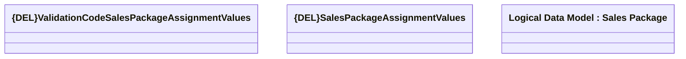

# {DEL}SalesPackageAssignmentValues

- **Diagram Type**: Logical
- **Package**: HomerSelect/BSL/Modules/Product Catalog (PRC)/Analytical Model/{ADD}Sales Package/Provided Services/Interface Provided/{DEL}COMMON for Sales Package
- **Diagram ID**: 154028
- **Elements**: 3
- **Connectors**: 0

