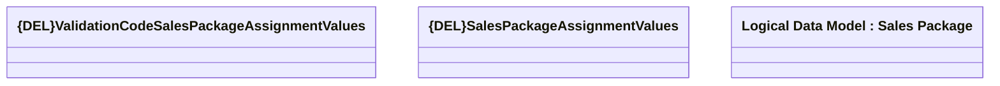

# {DEL}SalesPackageAssignmentValues

```mermaid
classDiagram
    class DEL_ValidationCodeSalesPackageAssignmentValues["{DEL}ValidationCodeSalesPackageAssignmentValues"]
    class DEL_SalesPackageAssignmentValues["{DEL}SalesPackageAssignmentValues"]
    class Logical_Data_Model_Sales_Package["Logical Data Model : Sales Package"]
```
