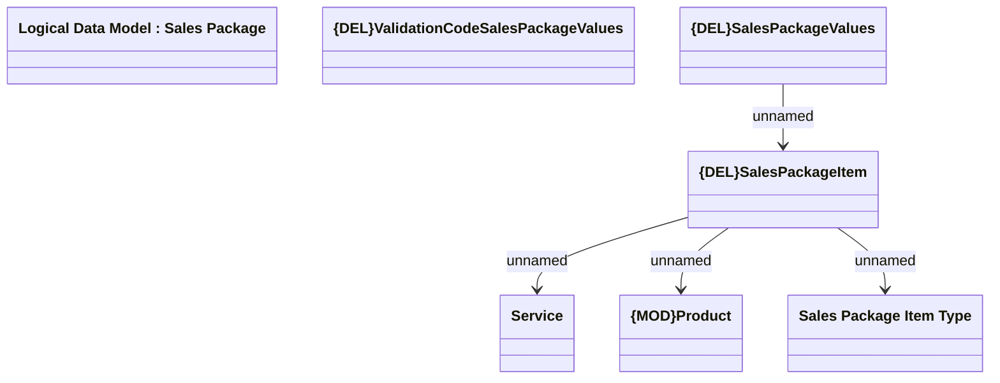

# {DEL}SalesPackageValues

```mermaid
classDiagram
    class Logical_Data_Model_Sales_Package["Logical Data Model : Sales Package"]
    class DEL_ValidationCodeSalesPackageValues["{DEL}ValidationCodeSalesPackageValues"]
    class DEL_SalesPackageItem["{DEL}SalesPackageItem"]
    class Sales_Package_Item_Type["Sales Package Item Type"]
    class MOD_Product["{MOD}Product"]
    class Service["Service"]
    class DEL_SalesPackageValues["{DEL}SalesPackageValues"]
    DEL_SalesPackageItem --> Service : unnamed
    DEL_SalesPackageItem --> MOD_Product : unnamed
    DEL_SalesPackageItem --> Sales_Package_Item_Type : unnamed
    DEL_SalesPackageValues --> DEL_SalesPackageItem : unnamed
```
