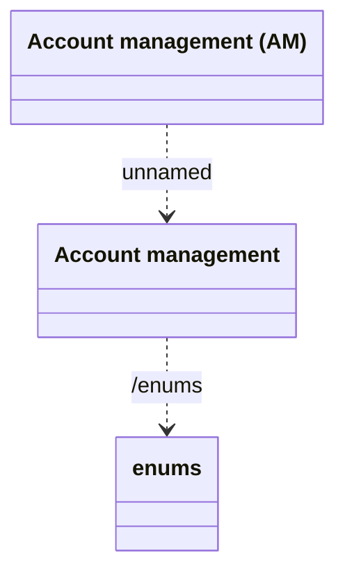

# AM API

- **Diagram Type**: Logical
- **Package**: HomerSelect/BSL/Modules/Product Catalog (PRC)/Interface Consumed/AM API
- **Diagram ID**: 136674
- **Elements**: 3
- **Connectors**: 2

```mermaid
classDiagram
    class enums["enums"]
    class Account_management["Account management"]
    class Account_management_AM["Account management (AM)"]
    Account_management ..> enums : /enums
    Account_management_AM ..> Account_management : unnamed
```
